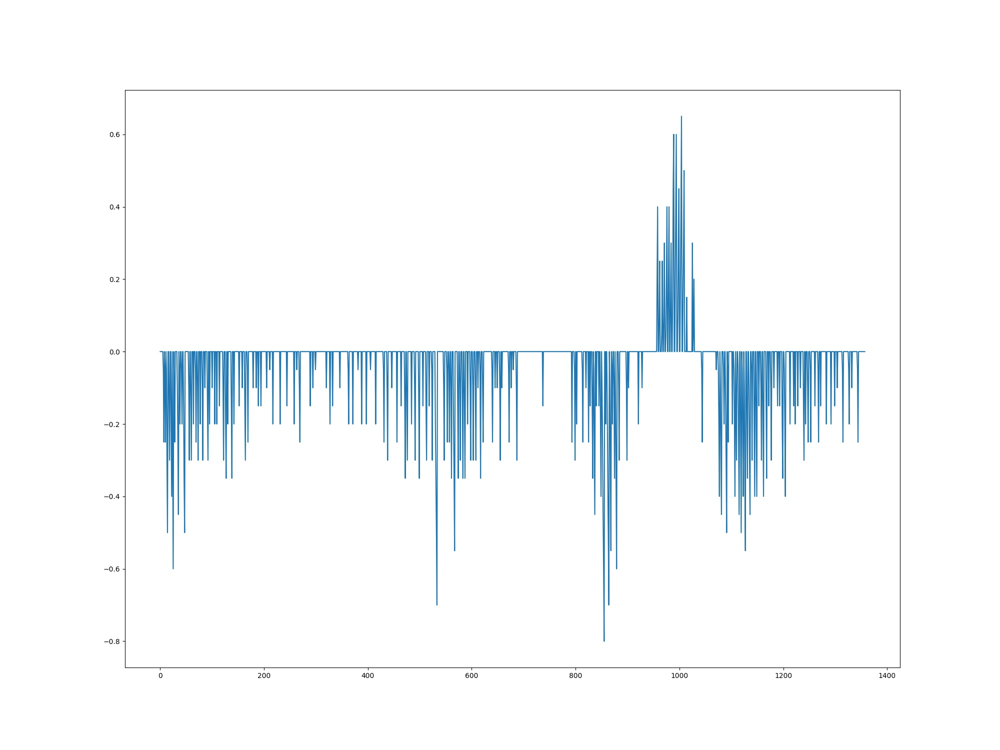
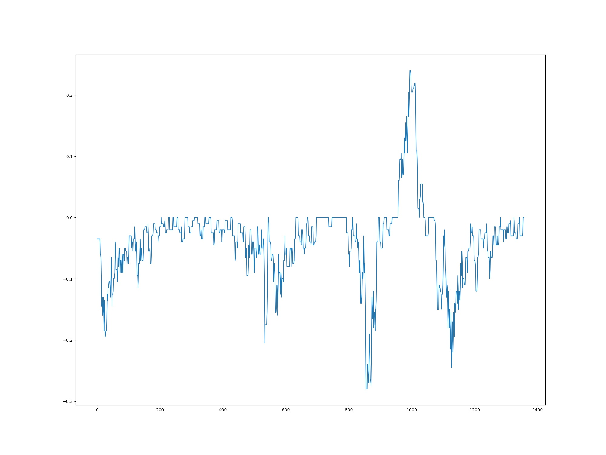
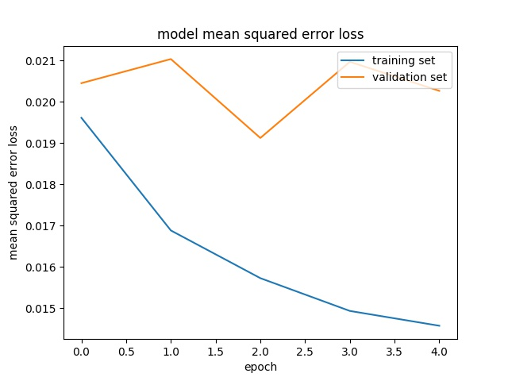

# **Behavioral Cloning** 

## Outline

The goals / steps of this project are the following:

* Use the simulator to collect data of good driving behavior
* Build, a convolution neural network in Keras that predicts steering angles from images
* Train and validate the model with a training and validation set
* Test that the model successfully drives around track one without leaving the road
* Summarize the results with a written report

## Detail

This writeup is following this [rublic](https://review.udacity.com/#!/rubrics/432/view).

### Files Submitted & Code Quality

#### 1. Submission includes all required files and can be used to run the simulator in autonomous mode

My project includes the following files:

* model.py containing the script to create and train the model
* drive.py for driving the car in autonomous mode
* model.h5 containing a trained convolution neural network
* writeup.md summarizing the results
* video.mp4 showing final result of online E2E

#### 2. Submission includes functional code

Using the Udacity provided simulator and my drive.py file, the car can be driven autonomously around the track by executing 

```sh
python drive.py model.h5
```

#### 3. Submission code is usable and readable

The model.py file contains the code for training and saving the convolution neural network. The file shows the pipeline I used for training and validating the model, and it contains comments to explain how the code works.

### Model Architecture and Training Strategy

#### 1. An appropriate model architecture has been employed

As a baseline, I used [NVidia's E2E model](https://devblogs.nvidia.com/deep-learning-self-driving-cars/), which was introduced in the lecture.


#### 2. Attempts to reduce overfitting in the model

The model contains dropout layers in order to reduce overfitting. 

The model was trained and validated on different data sets to ensure that the model was not overfitting.
The model was tested by running it through the simulator and ensuring that the vehicle could stay on the track.

#### 3. Model parameter tuning

The model used an adam optimizer, so the learning rate was not tuned manually.

#### 4. Appropriate training data

Training data was chosen to keep the vehicle driving on the road.
I used a combination of:

* center lane driving in ccw
* center lane driving in cw
* recovering from the left and right sides of the road
* focusing on curves

For details about how I created the training data, see the next section.

### Model Architecture and Training Strategy

#### 1. Solution Design Approach

The overall strategy for deriving a model architecture was to relate the camera images with steering angle.

My first step was to use a convolution neural network model similar to the NVIDIA's model.
I thought this model might be appropriate because it is proved to work in E2E self-driving tasks.

In order to gauge how well the model was working, I split my image and steering angle data into a training and validation set. I found that my first model had a low mean squared error on the training set but a high mean squared error on the validation set. This implied that the model was overfitting.

To combat the overfitting, I added dropout layers after each layers.

The final step was to run the simulator to see how well the car was driving around track one. There were a few spots where the vehicle fell off the track.
To improve the driving behavior in these cases, I added two kinds of training data.

1. Recovering from road sides to road center
   * I had to take care of not to add bad operation to the data, so I started to record data from road sides.
2. Focusing on curves
   * I had to add more curveing data because there are a few curves in track1.
   * Without adding this data, the model tends to learn going straight even in curves.

At the end of the process, the vehicle is able to drive autonomously around the track without leaving the road.

#### 2. Final Model Architecture

This final model architecture consisted of a convolution neural network with the following layers and layer sizes.

```python
# Input planes
model = Sequential()

# Normalized input planes
model.add(Lambda(lambda x: (x / 255.0) - 0.5, input_shape=(160, 320, 3)))
model.add(Cropping2D(cropping=((70, 25),(0, 0))))

# Convolutional feature map
model.add(Conv2D(24, (5, 5), padding='valid', activation='relu', strides=(2, 2)))
model.add(Dropout(dropout_rate))

# Convolutional feature map
model.add(Conv2D(36, (5, 5), padding='valid', activation='relu', strides=(2, 2)))
model.add(Dropout(dropout_rate))

# Convolutional feature map
model.add(Conv2D(48, (5, 5), padding='valid', activation='relu', strides=(2, 2)))
model.add(Dropout(dropout_rate))

# Convolutional feature map
model.add(Conv2D(64, (3, 3), padding='valid', activation='relu', strides=(1, 1)))
model.add(Dropout(dropout_rate))

# Convolutional feature map
model.add(Conv2D(64, (3, 3), padding='valid', activation='relu', strides=(1, 1)))
model.add(Dropout(dropout_rate))

# Flatten
model.add(Flatten())

# Fully-connected layer
model.add(Dense(100, activation='relu'))
model.add(Dropout(dropout_rate))

# Fully-connected layer
model.add(Dense(50, activation='relu'))
model.add(Dropout(dropout_rate))

# Fully-connected layer
model.add(Dense(10, activation='relu'))
model.add(Dropout(dropout_rate))

# Output
model.add(Dense(1))

model.compile(loss='mse', optimizer='adam')
```

#### 3. Creation of the Training Set & Training Process

To capture good driving behavior, I first recorded two laps on track one using center lane driving.

I then recorded the vehicle recovering from the left side and right sides of the road back to center so that the vehicle would learn to recover from road sides to road center.

To augment the data sat, I also flipped images and angles so that my model can learn clock-wise movement with counter-clock-wise data.

After the collection process, I had 60k+ number of data points.

I then preprocessed this data by smoothing.
As I used keyboard to control simulator, the log became noisy like this.



To avoid this causing learning error, I applied moving average filter to my steering data.
The following is the result of smoothing.



I finally randomly shuffled the data set and put 20% of the data into a validation set.

I used this training data for training the model. The validation set helped determine if the model was over or under fitting.
The ideal number of epochs was 5 as evidenced by the following learning curve because the model is about to start overfitting.
I used an adam optimizer so that manually training the learning rate wasn't necessary.


